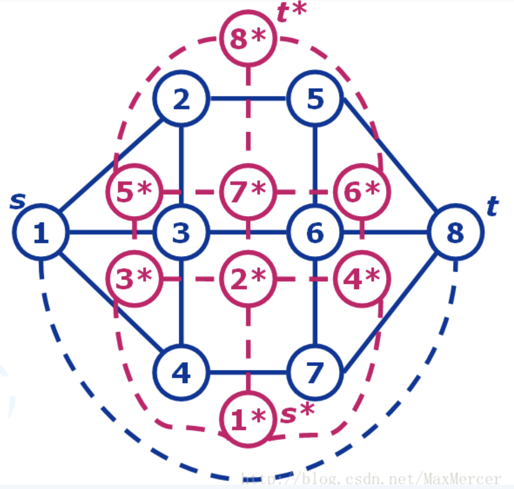

# 图论

## 匹配 ##

### 二分图的HK算法

luogu 3355
```c++
/* 时间复杂度 O(E·SQR(V)) */
/*mx[i] 与左边i相连的点。 my[i] 与右边i相连的点 */
/* g: 邻接链表   n1 左点数，n2 右点数*/
struct HK{
	int n1,n2;
	vector<int> g[maxn];
	int mx[maxn], my[maxn];
	queue<int> que;
	int dx[maxn],dy[maxn];
	bool vis[maxn];
	void addedge(int u , int v){
		g[u].push_back(v);
	}
	bool find(int u){
		for(int v : g[u]){
			if(!vis[v] && dy[v] == dx[u] + 1){
				vis[v] = 1;
				if(!my[v] || find(my[v])){
					mx[u] = v;
					my[v] = u;
					return true;
				} 
			}
		}
		return false;
	}
	void init(int _n1 , int _n2){
		n1 = _n1 ; n2 = _n2;
	}
	int matching(){
		CLR(mx,n1);
		CLR(my,n2); 
		int ans = 0;
		while(true){
			bool flag = false;
			while(!que.empty()) que.pop();
			CLR(dx,n1); CLR(dy,n2);
			repn(i,n1) if(!mx[i]) que.push(i);
			
			while(!que.empty()){
				int u = que.front(); que.pop();
				for (int v : g[u]){
					if(!dy[v]){
						dy[v] = dx[u] + 1;
						if(my[v]){
							dx[my[v]] = dy[v] + 1;
							que.push(my[v]);
						} else 
							flag = true;
					}
				}
			} 
			
			if(!flag) break;
			CLR(vis,max(n1,n2));
			repn(i,n1) if(!mx[i] && find(i)) ans++;
		}
		return ans;
	}
} solver;
```

### 二分图最大匹配O(N^3)

- BFS

```c++
namespace R {
    int n;
    int mb[N+7],vb[N+7],ka[N+7],kb[N+7],p[N+7],c[N+7];
    int e[N+7][N+7];
    int qf,qb,q[N+7];
    void Bfs(int u){
        int a,v=0,vl=0,d;
        for(int i=1;i<=n;i++) p[i]=0,c[i]=inf;
        mb[v]=u;
        do {
            a=mb[v],d=inf,vb[v]=1;
            for(int b=1;b<=n;b++)if(!vb[b]){
                    if(c[b]>ka[a]+kb[b]-e[a][b])
                        c[b]=ka[a]+kb[b]-e[a][b],p[b]=v;
                    if(c[b]<d) d=c[b],vl=b;
                }
            for(int b=0;b<=n;b++)
                if(vb[b]) ka[mb[b]]-=d,kb[b]+=d;
                else c[b]-=d;
            v=vl;
        } while(mb[v]);
        while(v) mb[v]=mb[p[v]],v=p[v];
    }
 
    int KM(){
        for(int i=1;i<=n;i++) mb[i]=ka[i]=kb[i]=0;
        for(int a=1;a<=n;a++)
        {
            for(int b=1;b<=n;b++)
                vb[b]=0;
            Bfs(a);
        }
        int res=0;
        for(int b=1;b<=n;b++)
            res+=e[mb[b]][b];
        return res;
    }
}
```

- DFS

Luogu4014 , 牛十
```c++  
const int N = 310;
struct KM{
	int nx,ny;//两边的点数
	int g[N][N];//二分图描述
	int linker[N],lx[N],ly[N];//y中各点匹配状态，x,y中的点标号
	int slack[N];
	bool visx[N],visy[N];
	void init(int x , int y){
		nx = x;
		ny = y;
	}
	 
	bool DFS(int x)
	{
	    visx[x] = true;
	    for(int y = 0; y < ny; y++)
	    {
	        if(visy[y])continue;
	        int tmp = lx[x] + ly[y] - g[x][y];
	        if(tmp == 0)
	        {
	            visy[y] = true;
	            if(linker[y] == -1 || DFS(linker[y]))
	            {
	                linker[y] = x;
	                return true;
	            }
	        }
	        else if(slack[y] > tmp)
	            slack[y] = tmp;
	    }
	    return false;
	}
	int run()
	{
	    memset(linker,-1,sizeof(linker));
	    memset(ly,0,sizeof(ly));
	    for(int i = 0;i < nx;i++)
	    {
	        lx[i] = -INF;
	        for(int j = 0;j < ny;j++)
	            if(g[i][j] > lx[i])
	                lx[i] = g[i][j];
	    }
	    for(int x = 0;x < nx;x++)
	    {
	        for(int i = 0;i < ny;i++)
	            slack[i] = INF;
	        while(true)
	        {
	            memset(visx,false,sizeof(visx));
	            memset(visy,false,sizeof(visy));
	            if(DFS(x))break;
	            int d = INF;
	            for(int i = 0;i < ny;i++)
	                if(!visy[i] && d > slack[i])
	                    d = slack[i];
	            for(int i = 0;i < nx;i++)
	                if(visx[i])
	                    lx[i] -= d;
	            for(int i = 0;i < ny;i++)
	            {
	                if(visy[i])ly[i] += d;
	                else slack[i] -= d;
	            }
	        }
	    }
	    int res = 0;
	    for(int i = 0;i < ny;i++)
	        if(linker[i] != -1)
	            res += g[linker[i]][i];
	    return res;
	}
}solver;
```
### 虚树
```c++ 

struct Edge{
	int v,c;
};

namespace VirtualTree{
    vector<Edge> G[N]; 
    int dfn[N], stk[N], dep[N], siz[N],minv[N][21],fa[N][21];; //static with original tree
  
  
    int vis[N];  
    vector<int> nG[N];			// mutable
    int vertices[N];
    int clk;	//dfn counter

    int cmp(int x, int y){
    	return dfn[x] < dfn[y];
    }

    inline int lca(int x,int y){
        if(dep[x] < dep[y]) swap(x,y);
        int t = dep[x] - dep[y];

        for (int i = 0 ; i <= 19 ; ++i){
            if(t & (1<<i)) x = fa[x][i];
        }   
        for (int i = 19 ; i >= 0 ; --i){
            if(fa[x][i] != fa[y][i]){
                x = fa[x][i];
                y = fa[y][i];
            }
        }
        return x == y ? x : fa[x][0];
    }
    
    #define per(i,a,b) for (int i = a ; i >= b; --i)
    int min_dist(int x, int y){
	   int cur = 0x3f3f3f3f;
	   if(dep[x] < dep[y]) swap(x,y);
	   
	   per(i,19,0) if(dep[x] - (1 << i) >= dep[y]) cur = min(cur,minv[x][i]),x = fa[x][i];
	   if(x == y) return cur;
	   
	   per(i,19,0) if(fa[x][i] != fa[y][i]) cur = min(cur,min(minv[x][i],minv[y][i])),x = fa[x][i],y = fa[y][i];
	   return min(cur,min(minv[x][0],minv[y][0]));
	}
    int dist(int x, int y){
        return dep[x] + dep[y] - 2 * dep[lca(x,y)];
    }

    void build_dfn(int rt = 1, int f = -1){
        dfn[rt] = ++clk;
        siz[rt] = 1;
	
        for (int i = 1 ; i <= 19 ; ++i){
            fa[rt][i] = fa[ fa[rt][i-1] ][i-1];
            minv[rt][i] = min(minv[rt][i-1],minv[fa[rt][i-1]][i-1]);
        }

        for (Edge& e : G[rt]){
        	int v = e.v;
            if(f == v) continue;
            
            dep[v] = dep[rt] + 1;
            fa[v][0] = rt;
    		minv[v][0] = e.c;
    		
            build_dfn(v, rt);
            //siz[rt] += siz[v];
        }
    }

    void addedge(int u, int v){
    //	de(u); debug(v);
        nG[u].push_back(v);
    }

    void build(int n){
    	static int dfn_built = 0;
    	if(!dfn_built) build_dfn(1,-1);
    	dfn_built = 1;
    	
        int top = 1, cnt = 0;
        stk[top] = 1;

        sort(vertices+1,vertices+n+1,cmp);
        for (int i = 1 + (vertices[1]==1) ; i <= n ; ++i){
            int x;
            while(top){
                x = lca(stk[top], vertices[i]);
                if(top > 1 && dep[x] < dep[ stk[top-1] ]){
                    addedge(stk[top-1], stk[top]);
                    top--;
                } else if (dep[x] < dep[ stk[top] ] ){
                    addedge(x, stk[top--]);
                    break;
                } else break;
            }
            if( stk[top] != x ) stk[++top] = x;
            stk[++top] = vertices[i];
        }
		while (--top) addedge(stk[top],stk[top+1]);
    }
};

```
### 一般图最大匹配（带花树） O(NM)

:牛一 
```c++
const int N = 2e3 + 100;
int n, m, match[N], pre[N];
int col[N], fa[N];
int que[N], head, tail;
std::vector<int> G[N];
 
int find(int x) {
  return x == fa[x] ? x : fa[x] = find(fa[x]);
}
 
int hash[N], hash_cnt;
// 暴力找LCA，交替爬升
inline int get_lca(int x, int y) {
  ++hash_cnt;
  while (hash[x] != hash_cnt) {
    if (x) hash[x] = hash_cnt, x = find(pre[match[x]]);
    std::swap(x, y);
  }
  return x;
}
 
 
inline void blossom(int x, int y, int p) {
  while (find(x) != p) {
    pre[x] = y;
    fa[y = match[x]] = fa[x] = p;
    if (col[y] == 1)
      col[que[tail++] = y] = 2;
    x = pre[y];
  }
}
 
inline int bfs(int st) {
  for (int i = 1; i <= n; ++i)
    col[i] = 0, fa[i] = i;
  col[que[tail = 1, head = 0] = st] = 2;
  while (head != tail) {
    int x = que[head++];
    for (int y : G[x]) {
      if (!col[y]) {
        col[y] = 1, pre[y] = x;
        if (!match[y]) {
          // 增广
          while (x) {
            x = match[pre[y]];
            match[match[y] = pre[y]] = y;
            y = x;
          }
          return 1;
        } else
          col[que[tail++] = match[y]] = 2;
      } else if (col[y] == 2 && find(x) != find(y)) {
        // 奇环，缩花
        int p = get_lca(x, y);
        blossom(x, y, p);
        blossom(y, x, p);
      }
    }
  }
  return 0;
}
 
```

2.2 网络流
---

注意如何输出解

### MCMF

luogu 4015,3356,1251
```c++
struct Edge{
    int from, to, cap, flow ,cost;
    Edge() {}
    Edge(int from, int to, int cap, int flow, int cost):from(from), to(to), cap(cap), flow(flow), cost(cost) {}
};

struct MCMF{
    int n, m, source, sink;
    vector<Edge> edges;
    vector<int> G[N];
    int d[N], f[N], p[N];
    bool vis[N];

    void init(int n) {
        this->n = n;
        for (int i = 0; i <= n; i++)
            G[i].clear();
        edges.clear();
    }

    void AddEdge(int from, int to, int cap, int cost) {
        edges.push_back(Edge(from, to, cap, 0, cost));
        edges.push_back(Edge(to, from, 0, 0, -cost));
        m = edges.size();
        G[from].push_back(m - 2);
        G[to].push_back(m - 1);
    }

    bool BellmanFord(int s, int t, int &flow, int &cost) {
        for (int i = 0; i <= n; i++)
            d[i] = INF;
        memset(vis, 0, sizeof(vis));
        vis[s] = 1; d[s] = 0; f[s] = INF; p[s] = 0;
        queue<int> Q;
        Q.push(s);

        while (!Q.empty()) {
            int u = Q.front();
            Q.pop();
            vis[u] = 0;

            for (int i = 0; i < G[u].size(); i++) {
                Edge &e = edges[G[u][i]];
                if (e.cap > e.flow && d[e.to] > d[u] + e.cost) {
                    d[e.to] = d[u] + e.cost;
                    p[e.to] = G[u][i];
                    f[e.to] = min(f[u], e.cap - e.flow);
                    if (!vis[e.to]) {
                        vis[e.to] = true;
                        Q.push(e.to);
                    }
                }
            }
        }

        if (d[t] == INF)
            return false;

        flow += f[t];
        cost += d[t] * f[t];

        int u = t;
        while (u != s) {
            edges[p[u]].flow += f[t];
            edges[p[u] ^ 1].flow -= f[t];
            u = edges[p[u]].from;
        }
        return true;
    }

    int Mincost(int s, int t) {
        int flow = 0, cost = 0;
        while (BellmanFord(s, t, flow, cost));
        return cost;
    }
};
```

### Dinic

luogu 2754
```c++
struct Edge {
    int to, cp;
    Edge(int to, int cp): to(to), cp(cp) {}
};

struct Dinic {
    static const int M = 1E5 * 5;
    int m, s, t;
    vector<Edge> edges;
    vector<int> G[M];
    int d[M];
    int cur[M];

    void init(int n, int s, int t) {
        this->s = s; this->t = t;
        for (int i = 0; i <= n; i++) G[i].clear();
        edges.clear(); m = 0;
    }

    void addedge(int u, int v, int cap) {
        edges.emplace_back(v, cap);
        edges.emplace_back(u, 0);
        G[u].push_back(m++);
        G[v].push_back(m++);
    }

    bool BFS() {
        memset(d, 0, sizeof d);
        queue<int> Q;
        Q.push(s); d[s] = 1;
        while (!Q.empty()) {
            int x = Q.front(); Q.pop();
            for (int& i: G[x]) {
                Edge &e = edges[i];
                if (!d[e.to] && e.cp > 0) {
                    d[e.to] = d[x] + 1;
                    Q.push(e.to);
                }
            }
        }
        return d[t];
    }

    int DFS(int u, int cp) {
        if (u == t || !cp) return cp;
        int tmp = cp, f;
        for (int& i = cur[u]; i < G[u].size(); i++) {
            Edge& e = edges[G[u][i]];
            if (d[u] + 1 == d[e.to]) {
                f = DFS(e.to, min(cp, e.cp));
                e.cp -= f;
                edges[G[u][i] ^ 1].cp += f;
                cp -= f;
                if (!cp) break;
            }
        }
        return tmp - cp;
    }

    int go() {
        int flow = 0;
        while (BFS()) {
            memset(cur, 0, sizeof cur);
            flow += DFS(s, inf);
        }
        return flow;
    }
} solver;
```

## 弦图/团

### 完美消除序列+弦图判断

bzoj1006,zoj1015
```c++
const int maxn  = 1e3 + 100;
int n,m;
struct Chordal{
	/* 
	   label 标号
	   R[i]   i的排名 
	   SA[i]  排名为i位置
	   弦图判断 N^2 : mat,isPerfect 
	*/ 
	
	vector<int> G[maxn];
	int R[maxn], label[maxn], SA[maxn];
	
	int mat[maxn][maxn];
	void addedge(int u , int v){
		G[u].push_back(v);
		G[v].push_back(u);
		mat[u][v] = mat[v][u] = 1;
	}
	void init(){
		for (int i = 0 ; i < maxn ; ++i) G[i].clear();
		memset(mat,0,sizeof(mat));
	} 
	
	void mcs(){
		priority_queue<pii> pq;
		memset(R,-1,sizeof(R));
		memset(label,0,sizeof(label));
		
		repn(i,n) pq.push(mk(0,i));
		
		int id = n;
		while(id >= 1){
			int cur = pq.top().se; pq.pop();
			if(R[cur] != -1) continue;
			
			SA[id] = cur;
			R[cur] = id--;
			
			for (int v : G[cur]){
				if(R[v] != -1) continue;
				label[v]++;
				pq.push(mk(label[v],v));
			}
		} 
	}
	 
	bool isPerfect() {	
	    for(int u = 1; u <= n; ++u) {
	        int t = u + 1;
	        while(t <= n && !mat[SA[u]][SA[t]]) ++t;
	        if(t > n) continue;
	        for(int v = t + 1; v <= n; ++v) if(mat[SA[u]][SA[v]])
	            if(!mat[SA[t]][SA[v]]) return false;
	    }
	    return true;
	}
}solver;
```

## 对偶图最短路求最小割

- 将s与t之间连一条边。
- 得到一个附加面。把刚刚的附加面设为对偶图里的$s*$， 无界面的点设为$t*$，将平面图转化为对偶图。
- 把$s*$-$t*$给去掉。此时s*-t*的路径， 就对应了s-t的割。那么如果我们把对偶图里每条边附上一个权值， 这个权值就等价于原图里每条边的流量， 那么原图中的最小割就等于$s* - t*$的最短路。
- 

## MST

### XOR-MST

- 边权为点权的异或，求最小生成树。

```c++
const int N = ...;
vector<pii> es[N];
int n, a[N];
void build(int x,int fa){
    for(auto &e: es[x]){
        if(e.fir == fa) continue;
        a[e.fir] = a[x] ^ e.sec;
        build(e.fir, x);
    }
}
int T[N*35][2], tot;
ll ans;
void Insert(int x){
    int p = 1;
    for(int i = 29; i>=0; --i){
        int id = (x>>i)&1;
        if(T[p][id] == 0){
            T[p][id] = ++tot;
            p = T[p][id];
            T[p][0] = T[p][1] = 0;
        } else {
            p = T[p][id];
        }
    }
}
int search(int x){
    int val = 0, p = 1;
    for(int i = 29; i>=0; --i){
        int id = (x>>i)&1;
        if(!T[p][id]) id ^= 1;
        if(id) val |= (1<<i);
        p = T[p][id];
    }
    return val;
}
void dfs(int id,int l,int r){
    if(id < 0) return ;
    int mid = l;
    for(int i = l; i<r; i++){
        if((a[i]>>id) & 1){
            mid = i;
            break;
        }
    }
    if(mid < r) dfs(id-1, mid, r);
    if(l < mid) dfs(id-1, l, mid);
    if(l < mid && mid < r){
        tot = 1; T[tot][0] = T[tot][1] = 0;
        for(int i = l; i<mid; i++) Insert(a[i]);
        int val = (1<<30);
        for(int i = mid; i<r; i++) val = min(val, a[i]^search(a[i]));
        ans += val;
    }
}
ll xor_mst(){
    sort(a,a+n);
    ans = 0;
    dfs(29, 0, n);
    return ans;
}
int main(){
    a[0] = 0; build(0, -1);
  	xor_mst();
}
```


### 欧拉欧拉欧拉欧拉欧拉
- 无向图：

存在欧拉回路的条件：原图连通，每个结点均为偶度结点。

存在欧拉通路的条件：存在欧拉回路，或原图连通，有两个结点为奇度结点，其他结点均为偶度结点。

- 有向图：

存在欧拉回路的条件：基图连通，每个结点的入度等于出度。

存在欧拉通路的条件：存在欧拉回路，或基图连通，有一个结点入度等于出度+1，有一个结点出度等于入度+1，其他结点的入度等于出度。

- 混合图：

存在欧拉回路的条件：

1.将无向边随便定向，每个结点的入度与出度之差为偶数。

2.进行网络流，若满流，则存在欧拉回路。

（网络流构图：忽略有向边。对于随便定向的无向边，按照所定向连边，流量为1 。对于入度大于出度的点u，连边（u，T），流量为 abs( (in[u]-out[u])/2 )。对于出度大于入度的点v，连边（S，v），流量为abs( (in[v]-out[v])/2 )）。

- 存在欧拉通路的条件：存在欧拉回路，或

1.将无向边随便定向，有两个结点的入度与出度之差为奇数，其他结点的入度与出度之差为偶数。

2.在两个奇度结点间连一条无向边，进行网络流，若满流，则存在欧拉通路。

（网络流构图：忽略有向边。对于随便定向的无向边，按照所定向连边，流量为1 。对于入度大于出度的点u，连边（u，T），流量为 abs( (in[u]-out[u])/2 )。对于出度大于入度的点v，连边（S，v），流量为abs( (in[v]-out[v])/2 )）。

 ## 树的计数

 ### 矩阵树定理

> Matrix-tree Theorem
>
> ​	设图$G=(V,E)$，拉普拉斯矩阵$L$，则$G$的生成树个数等于$detL_0$，其中$L_0=0$是去掉$L$第i列第i行得到的子矩阵（i任意）。
>
> ​	定义G的拉普拉斯矩阵（Laplacian matrix）$L(G)$：
>
> ​	$$L_{ij}=\begin{cases}-m_{ij}(number\ of\ edges)&i\neq j\\deg(v_i)&i=j \end{cases} \ $$
>
> ​	$L(G)=M(G)M^T(G)$，$M(G)$是G的关联矩阵。
>
> 关联矩阵：对于有向图，若$b_{ij} = 1$，表示边j离开点i；$b_{ij} = -1$， 表示边j进入点i；$b_{ij} = 0$，表示边j和点i不相关联。

```c++
/*
	给一个n点m边的无向图（无自环）。定义生成树的权值为所有边的按位与。求随机选出一个生成树的权值期望。
*/

#include<bits/stdc++.h>
using namespace std;
#define ll long long
#define pb push_back
#define pii pair<int, int>
#define fir first
#define sec second
const int mod = 998244353;
const int N = 1e2+10;
const int M = 1e4+10;
inline int add(int a,int b) {return a+b>=mod? a+b-mod: a+b;}
inline int sub(int a,int b) {return a<b? a-b+mod: a-b;}
inline int mul(int a,int b) {return 1LL*a*b%mod;}
int qpow(int a, int b){
    int ret = 1;
    for(; b; b>>=1){
        if(b & 1) ret = mul(ret, a);
        a = mul(a, a);
    }
    return ret;
}

//高斯消元求行列式
int Determinant(const vector<vector<int>>& A) {
    int res = 1;
    int n = A.size(), cnt = 0;
    vector<vector<int>> B(n, vector<int>(n));
    for (int i = 0; i < n; ++i){
        for (int j = 0; j < n; ++j){
            B[i][j] = A[i][j];
        }
    }
    for (int i = 0; i < n; ++i) {
        int pivot = i;
        for (int j = i; j < n; ++j){
            if (abs(B[j][i]) > abs(B[pivot][i]))pivot = j;
        }
        if (i != pivot) {
            swap(B[i], B[pivot]);
            cnt ^= 1;
        }
        if (B[i][i] == 0) return 0;
        int val = qpow(B[i][i], mod - 2);
        for (int j = i + 1; j < n; ++j) {
            int coe = mul(B[j][i], val);
            for (int k = i; k < n; ++k){
                B[j][k] = sub(B[j][k], mul(coe,B[i][k]));
            }
        }
    }
    for (int i = 0; i < n; ++i) res = mul(res, B[i][i]);
    if (cnt) res = sub(mod, res);
    return res;
}

struct E{
    int x, y, z;
}es[M];

int L[N][N]; vector<vector<int>> A;
int main(){
    int T; cin>>T;
    while(T--){
        int n, m; scanf("%d%d",&n,&m);
        for(int i = 1; i<=m; i++) scanf("%d%d%d",&es[i].x,&es[i].y,&es[i].z);
        memset(L, 0, sizeof(L));
        A.clear();
        for(int i = 1; i<=m; i++){
            int x = es[i].x, y = es[i].y;
            L[x][x]++; L[y][y]++;
            L[x][y]--; L[y][x]--;
        }
        int fz = 0, fm = 0;
        for(int i = 1; i<n; i++){
            vector<int> t;
            for(int j = 1; j<n; j++) t.pb(L[i][j]);
            A.pb(t);
        }
        fm = Determinant(A);
        for(int k = 0; k<30; k++){
            memset(L, 0, sizeof(L));
            A.clear();
            for(int i = 1; i<=m; i++){
                if(es[i].z & (1<<k)){
                    int x = es[i].x, y = es[i].y;
                    L[x][x]++; L[y][y]++;
                    L[x][y]--; L[y][x]--;
                }
            }
            for(int i = 1; i<n; i++){
                vector<int> t;
                for(int j = 1; j<n; j++) t.pb(L[i][j]);
                A.pb(t);
            }
            fz = add(fz, mul(1<<k, Determinant(A)));
        }
        printf("%d\n",mul(fz, qpow(fm,mod-2)));
    }
}
```

### Prufer序列

#### 概念

>Prufer序列是无根树的一种数列。
>
>在组合数学中，Prufer序列由一个对于顶点标过号的树转化来的序列，点树为n的树转化来的Prufer序列长度为n-2。
>
>对于一颗确定的无根树，对应着唯一的Prufer序列。

- 无根树$\rightarrow $Prufer序列

1、找到遍号最小的度数为1的点。

2、删除该点并在序列中添加与该点相连的点的编号。

3、重复前两步，直到整棵树只剩下两个点。

- Prufer序列$\rightarrow $无根树

````clike
//伪代码
init set = prufer序列未出现的元素
for p in prufer序列：
	q：set中最小元素
	set.erase(q)
	edge:(p,q)
	if：p为最后一次出现在prufer序列
		set.insert(p)
edge: st剩余的两个元素
````

- 应用
    - n个点的标记无根树方案数：$n^{n-2}$
    - n个点的标记有根树方案数：$n^{n-2}\times n = n^{n-1}$
    - n个点的标记无根树方案数，同时要求第$i$个的度数为$d_i$（即第$i$个点出现$d_i-1$次）：$\frac{(n-2)!}{\Pi(d_i-1)}$

#### 例题

2020牛客7-I

- 一个森林的代价为内部每个节点度数的平方和，问所有带标号的$n$个点的森林的代价和
- 做法
    - 一个森林内部节点度数的平方和等于 2*(长度为2的路径数 + 长度为3的路径数)
    - 
