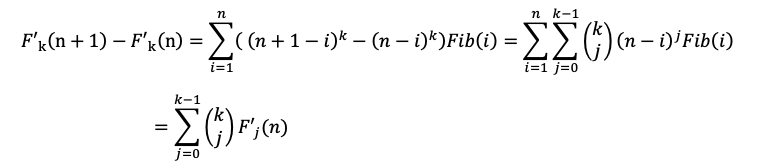

# 其他经典问题

## 约瑟夫问题

### Let the Flames Begin（2018icpc沈阳）

- 题意

​	约瑟夫环背景，n人第k个被选出，求第$m$个被选出来的人位置。

​	$1\le T\le1000, 1\le n,m,k\le 10^{18},\sum min\{m,k\}\le2\times 10^6$

- 思路

​	设每k个人选出一个，n个人第m个被选出来的标号为$A(n,m)$。

​	考虑如何递推。第一次被选出来的人一定是k-1，当他被选出来后，问题转化为了n-1的选出m-1个人。考虑将最终结果进行坐标变换即可。

​	那么有递推式：

​	$A(n,m)=(A(n-1,m-1)+k)\%n$

​	由于限制$\sum min\{m,k\}\le2\times 10^6$，考虑分情况讨论：

​	（1）当m较小时：

​	直接递推，复杂度为$O(m)$。

​	（2）当$k$较小时：

​	当$A(n-1,m-1)+k<n$时，不需要$\%n$，可以利用这一点加速递推：

​			$A+xk<n+x$

​	$\Rightarrow x(k-1)<n-A$

​	$\Rightarrow x<\frac{n-A}{k-1}$

​	这样复杂度接近$O(k)$。

​	注意对$k==1$的时候，特判一下。

- 代码

```c++
#include<bits/stdc++.h>
using namespace std;
#define ll long long
#define pb push_back
#define pii pair<int, int>
#define pll pair<ll, ll>
#define pli pair<ll, int>
#define pss pair<string, string>
#define pdd pair<double, double>
#define fir first
#define sec second
const int N = 2e6+10;
const int base = 2e6+10;
ll f(ll n,ll m,ll k){
    if(m == 1) return (k-1)%n;
    return (f(n-1,m-1,k)+k)%n;
}
int main(){
    int T; cin>>T;
    for(int cs = 1; cs<=T; cs++){
        printf("Case #%d: ",cs);
        ll n, m, k; scanf("%lld%lld%lld",&n,&m,&k);
        if(k == 1) {
            printf("%lld\n",m);
            continue;
        }
        if(m <= base) printf("%lld\n",f(n,m,k)+1);
        else {
            ll tn = n-m+1;
            ll ans = (k-1)%tn;
            ll now = 1;
            while(now < m){
                if(ans+k >= tn+1){
                    tn++;
                    ans = (ans+k)%tn;
                    now++;
                    continue;
                }
                ll x = (tn-ans-1)/(k-1);
                x = min(x, m-now);
                now += x;
                ans += k*x;
                tn += x;
            }
            printf("%lld\n",ans+1);
        }
    }
}
```

### Josephus Transform（2020牛客多校-6）

- 题意

​	给一个排列$P=\{1,2,3,...,n\}$。

​	定义$k-Josephus\ transform$：不断选出第k个，直到组成一个新的排列。

​	m次操作。每次操作给出x,k，令排列进行$x$次$k-Josephus\ transform$。

​	所有操作结束后，回答最终排列的情况。

​	$1\le n,m\le 10^5,1\le n\times m\le 10^6,1≤k≤n,1≤x≤10^9$

- 思路

​	对于一次$k-Josephus\ transform$，实际上就是求出被选出的第$1,2,3,...,n$个人的所有的标号。我们可以利用线段树，整体$O(nlogn)$处理出答案。

​	得到置换群后。问题就是求进行$x$次置换操作后，每个数的位置。可以处理出置换群中的每个环，然后$O(1)$的找到最终位置，这样复杂度与$k$无关，整体复杂度是$O(n)$的。

​	共$m$次操作，复杂度为$O(nmlogn)$。	

- 代码

```c++
#include<bits/stdc++.h>
using namespace std;
#define ll long long
#define pb push_back
#define pii pair<int, int>
#define pll pair<ll, ll>
#define pli pair<ll, int>
#define pss pair<string, string>
#define pdd pair<double, double>
#define fir first
#define sec second
const int N = 1e5+10;
struct node{
    int l, r, sum;
}T[N*4];
void build(int p,int L,int R){
    T[p].l = L; T[p].r = R;
    if(L == R){
        T[p].sum = 1;
        return ;
    }
    int mid = (L+R)/2;
    build(p*2, L, mid);
    build(p*2+1, mid+1, R);
    T[p].sum = T[p*2].sum+T[p*2+1].sum;
}
int query(int p,int pos){
    T[p].sum --;
    if(T[p].l == T[p].r) return T[p].l;
    if(T[p*2].sum >= pos) return query(p*2, pos);
    else return query(p*2+1, pos-T[p*2].sum);
}
int a[N], ans[N], to[N], v[N], tmp[N];
vector<int> circle;
void tsf(int n,int x){
    for(int i = 1; i<=n; i++) v[i] = 0;
    for(int i = 1; i<=n; i++){
        if(v[i]) continue;
        circle.clear();
        int t = i;
        while(!v[t]){
            circle.pb(t);
            v[t] = 1;
            t = to[t];
        }
        int sz = (int)circle.size();
        for(int j = 0; j<sz; j++){
            tmp[circle[(j+x)%sz]] = a[circle[j]];
        }
    }
    for(int i = 1; i<=n; i++) a[i] = tmp[i];
}
int main(){
    int n, m; cin>>n>>m;
    for(int i = 1; i<=n; i++) a[i] = i;
    while(m--){
        build(1, 1, n);
        int k, x; scanf("%d%d",&k,&x);
        int pos = 1;
        for(int i = 1; i<=n; i++){
            pos = (pos-1+k-1) % (n-i+1) + 1;
            to[query(1, pos)] = i;
        }
        tsf(n, x);
    }
    for(int i = 1; i<=n; i++) printf("%d%c",a[i]," \n"[i==n]);
}
```

 ## 反悔贪心

### 数据备份

- 题意

​	一条数轴上$n$个点。选择$k$对两两匹配。求距离之和最小的方案。

​	$1\le n\le 10^5, 1\le k\le n/2$

- 思路

​	首先配对的两个点必定是相邻的。

​	这样共有$n-1$个可能配对。考虑naive贪心，维护最小堆，每次取最小的匹配，并将两边标记。在此基础上反悔贪心，将一种匹配取出后，如果反悔，即考虑选取两边匹配，并去掉当前匹配，注意如果反悔，必然要同时取两边。

- 代码

```c++
#include <bits/stdc++.h>

#define rep(i,a,b) for(int i=(a); i<=(b); ++i)
#define per(i,a,b) for(int i=(a); i>=(b); --i)

using namespace std;

#define gc() getchar()
inline int read()
{
    int now=0,f=1; char c=gc();
    for(;!isdigit(c);c=='-'&&(f=-1),c=gc());
    for(;isdigit(c);now=now*10+c-48,c=gc());
    return now*f;
}

const int N = 1e5+10;
const int inf = 1e9;

struct node{
    int id, val;
    bool operator < (const node &othr) const{
        return val > othr.val;
    }
};
priority_queue<node> pq;

struct seg{
    int l, r, val;
} a[N];
void del(int x){
    a[x].l = a[a[x].l].l;
    a[x].r = a[a[x].r].r;
    a[a[x].l].r = x;
    a[a[x].r].l = x;
}
int vis[N];
int main(){
    int n=read(), k=read();
    int Pre = read();
    rep(i,1,n-1){
        int Nw = read();
        pq.push(node{i,Nw-Pre});
        a[i]=seg{i-1,i+1,Nw-Pre};
        Pre = Nw;
    }
    memset(vis,0,sizeof(vis));
    int ans=0;
    a[0].val = a[n].val = inf;
    rep(i,1,k){
        while(!pq.empty() && vis[pq.top().id]) pq.pop();
        node x = pq.top(); pq.pop();
        ans += x.val;
        x.val = a[x.id].val = a[a[x.id].l].val + a[a[x.id].r].val - x.val;
        vis[a[x.id].l] = vis[a[x.id].r] = 1;
        pq.push(x);
        del(x.id);
    }
    printf("%d\n",ans);
    return 0;
}
```

## 括号问题

### Editor

- 题意

​	模拟打字机n次操作。操作包含指针左、右移（只有左边界1），打上一个字符c（包含小写字母和括号）。问每次操作后，回答最大的括号嵌套层数（若合法）。

​	$N\leq 1e6$

- 思路

​	问题简化后，即对于1～n的序列，每次操作后最大括号嵌套层数。

​	定义：‘(’值为1，‘)’值为-1。用线段树维护区间前缀和，前缀最大、最小值。

​	前缀最小==0 && 前缀和==0时，序列合法。前缀最小==0，保证任意时刻‘(’>=‘)’；前缀和==0，保证最终‘(’==‘)’。通过反证，两条件结合为充分必要条件。

​	在保证合法的情况下，前缀最大即最大嵌套层数。

​	三个值都满足区间可加性，故可以用线段树维护。

- 代码

```c++
#include<bits/stdc++.h>
#define ll long long
#define pb push_back
using namespace std;
const int maxn = 1e6+10;
struct node{
    int sum, Min, Max;
    int l, r;
}T[maxn*4];
void build(int p,int L,int R){
    T[p].l = L, T[p].r = R;
    T[p].sum = T[p].Min = T[p].Max = 0;
    if(L == R) return ;
    int mid = (L+R)/2;
    build(p*2,L,mid); build(p*2+1,mid+1,R);
}
void change(int p,int x,int k){
    if(T[p].l == T[p].r){
        T[p].sum = T[p].Min = T[p].Max = k;
        return ;
    }
    int mid = (T[p].l+T[p].r)/2;
    if(x<=mid) change(p*2,x,k);
    else change(p*2+1,x,k);
    T[p].sum = T[p*2].sum + T[p*2+1].sum;
    T[p].Max = max(T[p*2].Max,T[p*2].sum+T[p*2+1].Max);
    T[p].Min = min(T[p*2].Min,T[p*2].sum+T[p*2+1].Min);
}
char s[maxn];
int main(){
    int n; cin>>n;
    build(1,1,n);
    scanf("%s",s+1);
    int p = 1;
    for(int i = 1; i<=n; i++){
        int c = s[i];
        if(c == 'L') p = max(1,p-1);
        else if(c == 'R') p = p+1;
        else if(c == '(') change(1,p,1);
        else if(c == ')') change(1,p,-1);
        else change(1,p,0);
        if(T[1].sum == 0 && T[1].Min == 0){
            printf("%d ",T[1].Max);
        } else {
            printf("-1 ");
        }
    }
}
```

## Fibonacci

### 通项公式

$$
F_n = \frac{1}{\sqrt 5}[(\frac{1+\sqrt5}{2})^n-(\frac{1-\sqrt5}{2})^n]
$$

### 斐波那契和（第十七届同济大学校赛）

题意

​	$Fib(i)$表示斐波那契函数，

​	给定正整数$n$和$k$，求： $\sum_{i=1}^ni^kFib$(i)

​	结果对998,244,353取余。 

​	$1\leq n\leq 10^{18}, 1\leq k\leq 100$

思路

​	考虑$F_k'(n)=\sum_{i=1}^n(n-i)^kFib(i)$，这个比$F_k(n)=\sum_{i=1}^ni^kFib(i)$好求一些。

​	做一次差分，可以得到：

​		

​	可以用矩阵快速幂求出所有$F_j'(n)$。

​		对一个向量，维护$Fib(n),Fib(n-1)$以及所有$F'_j(n)$，

​		对于$F'_0(n+1)$，用$F_0'(n+1)=F_0'(n)+F_0'(n-1)$计算，其他用上述公式。

​		向量共k+3维。

​	得到$F'_j(n)$之后，我们可以展开得到关于$F(n)$的表达式：

​	$F_k'(n)=\sum_{j=0}^kn^{k-j}(-1)^jF_j(n)$，

​	得到，$(-1)^kF_k(n)=F_k'(n)-\sum_{j=0}^{k-1}n^{k-j}(-1)^jF_j(n)$。

​	复杂度$O(k^3log(n))$

### Fibonacci Sum（2020hdu多校1）

题意

​	给出$N,C,K$，求$(F_C)^K+(F_{2C})^K+...+(F_{NC})^K(mod\ 10^9+9)$。

​	$1\le N,C\le10^{18},1\le K\le10^5$

思路

​	$F_n=\frac{1}{\sqrt5}[(\frac{1+\sqrt5}{2})^n-(\frac{1-\sqrt5}{2})^n]$。

​	注意到，$5^\frac{10^9+9-1}{2}\equiv 1(mod\ 10^9+9)$，即$x^2\equiv 5(mod\ 10^9+9)$有解。本地暴力预处理，得到$383008016^2\equiv 5(mod\ 10^9+9)$。

​	因此原通项公式可写为：$F_n\equiv d(a^n-b^n)(mod\ 10^9+9)$。

​	进一步$\sum_{i=1}^N(F_{Ci})^K\equiv \sum_{i=1}^N\{d(a^{Ci}-b^{Ci})\}^K\equiv d^K\sum_{j=0}^KC(K,j)\sum_{i=1}^N(-1)^j(a^{K-j}b^j)^{Ci}$。内层等比数列求和公式化简，外层枚举即可。
